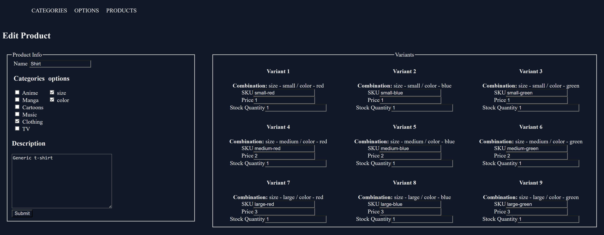
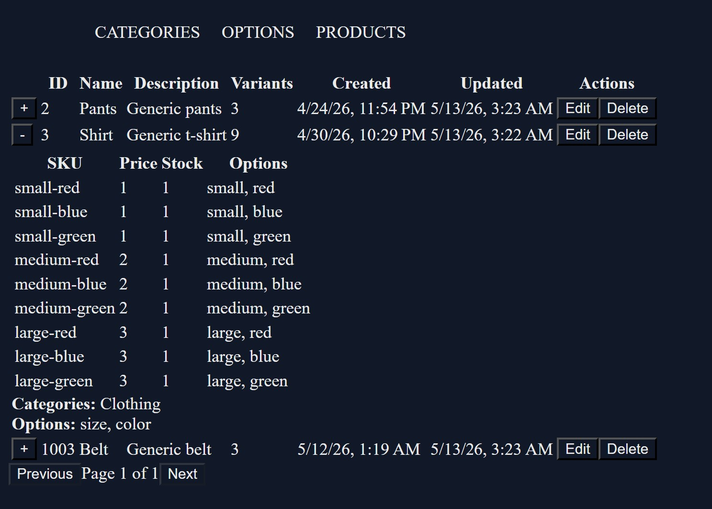

# Angular-.NET-Core-Product-Management-System
Full-stack product management system built with Angular and ASP.NET Core featuring dynamic product variants, reactive forms, signals, and EF Core aggregate synchronization.

The application manages a product catalog where each product can have:

- Categories
- Options (e.g. Color, Size)
- Option Values (e.g. Red, Blue, Small, Large)
- Dynamically generated product variants based on option combinations

Product variants are generated using a cartesian product algorithm and synchronized with persisted state while preserving user edits.

## Features

### Frontend

- Product, Category, and Option CRUD UI
- Dynamic product variant generation
- Cartesian product generation for all valid variant combinations
- Variant reconciliation preserving existing edits
- Expandable product list with nested variants
- Pagination support
- Strongly typed Angular reactive forms
- Angular signals + computed/effect architecture
- Shared create/edit forms
- Edit mode state hydration from backend DTOs

### Backend

- ASP.NET Core REST APIs
- Entity Framework Core relational aggregate synchronization
- Product, category, option, and variant management
- DTO projection
- Global exception handling middleware

## Tech Stack

### Frontend

- Angular
- TypeScript
- Reactive Forms
- rxResource
- Signals

### Backend

- ASP.NET Core Web API
- Entity Framework Core
- MSSQL Server

## Architecture Concepts

- Reactive state management
- Dynamic form reconciliation
- Aggregate synchronization
- DTO projection
- Relational data modeling
- Cartesian product generation
- Nested aggregate updates

## Screenshots
### Product Form

### Product List

## Architecture Notes
### Dynamic Variant Generation

Product variants are generated from selected product options using a cartesian product algorithm. Existing variant rows are preserved through reconciliation logic using stable variant identity keys.

### Reactive Form Synchronization

The frontend uses Angular signals, computed values, and effects alongside Reactive Forms. Form state is synchronized with derived reactive state while preserving user edits during edit-mode hydration.

### Aggregate Update Pattern

The backend performs manual reconciliation of nested aggregates including:

- product categories
- product options
- product variants
- variant option values

This avoids blind entity replacement and maintains relational consistency.

## Form Architecture

The application uses strongly typed Angular Reactive Forms with:

- FormArray for dynamic variant rows
- FormControl<number[]> for generated relational values
- Shared create/edit form architecture
- Form seeding from backend DTOs
- Synchronization guards to prevent derived state overwrites
