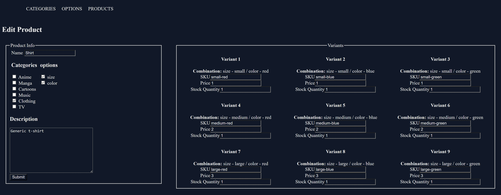
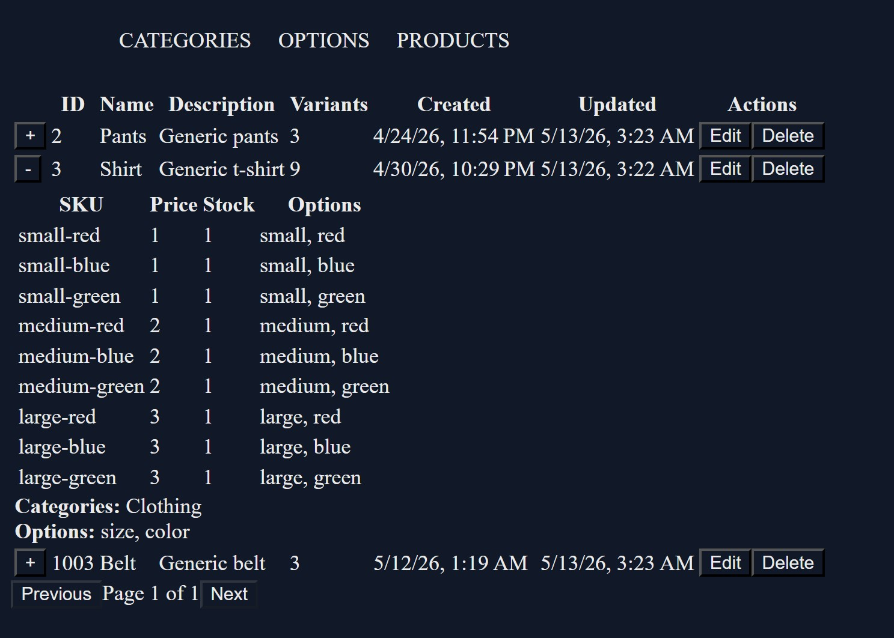

# Angular/.NET eCommerce System

Fullstack eCommerce platform built with Angular, .NET Core, PostgreSQL, and Entity Framework featuring dynamic product variants, shopping cart functionality, authentication, authorization, and relational data management.

---

## Live Demo
https://angular-net-core-product-management-dbm6.onrender.com

### Demo Accounts

Admin:
- Email: admin@ecommerce.com
- Password: Admin123!

Customer:
- Email: test@example.com
- Password: Customer123!

---

## Features

### Customer
- Registration and JWT authentication
- Shopping cart management
- Add, update, remove, and clear cart items
- Stock validation

### Admin
- Role-based authorization
- Product CRUD
- Category management
- Option and option value management
- Product variant management

---

## Tech Stack

### Frontend
- Angular
- Typescript
- Reactive Forms
- Signals
- RxResource

### Backend
- ASP.NET Core Web API
- Entity Framework Core
- PostgreSQL
- MediatR
- FluentValidation
- ASP.NET Core Identity
- JWT Authentication

### Infrastructure
- Docker
- Docker Compose
- EF Core migrations
- PostgreSQL integration testing

---

## Screenshots

### Product Form

### Product List

---

## Product Variant Management

Products support dynamically generated variants.

Example:

Color:
Red, Blue

Size:
Small, Large

Generated:
Red / Small
Red / Large
Blue / Small
Blue / Large

During updates the backend reconciles Product categories, options, variants, and option values without replacing the entire aggregate.

---

## Shopping Cart

- One cart per customer
- Product variant selection
- Quantity updates
- Stock checks
- Total calculation through projections

---

## Testing
- xUnit
- Testcontainers PostgreSQL
- Respawn database resets

---

## Running the Project

### Requirements
- Docker Desktop
- Docker Compose

No local PostgreSQL installation required.

Start: 

docker compose up --build

The application will:

- Build the Angular frontend
- Build the ASP.NET Core API
- Start PostgreSQL
- Apply migrations
- Start the application

---

## Access

Frontend:

http://localhost:4200

Backend:

http://localhost:5001